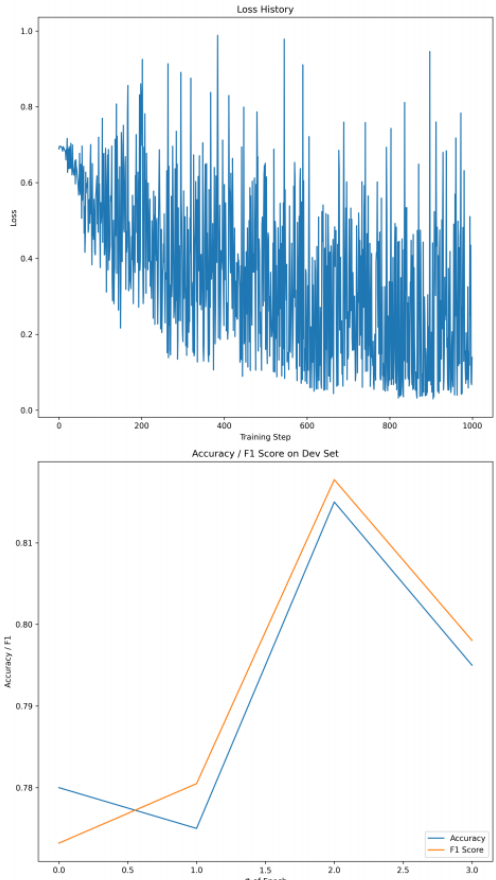

# NLP Projects using TensorFlow

## Environment requirement:
- [Anaconda or Miniconda](https://docs.conda.io/projects/continuumio-conda/en/latest/user-guide/install/index.html)
- tensorflow==2.6.2
- nltk==3.6.2
- gensim==3.7.2
- scikit-learn==0.24.2
- scipy==1.5.4
- pandas==1.1.5
- seaborn==0.9.0
- numpy==1.19.5

## Sentiment Polarity in Movie Reviews

### Description:
The movie-review dataset2 consists of movie reviews labeled with sentiment polarity (i.e. “positive review” or “negative review”). The project presents a variation of the perceptron which learns to identify the sentiment in a review.

### Data:
There is a training, development and test dataset. Each line in these datasets has three entries, separated by a tab character (\t). The first is the movie review (available only for reference),
the second is the sentiment label (POSitive or NEGative). To facilitate the task, the third entry is a 100-dimensional vector representing the review (we’ll cover in later lectures on word embeddings how this sentence representation has been generated). Keras module from Tensorflow is adopted here.

### Perceptron:
- As the loss function, choose square-loss.
- For the activation function, use the sigmoid function.
- For the weight update rule, use the mini-batch stochastic gradient descent formula.
- Use the 100-dimensional vectors from the datasets for the input vectors x. Encode the corresponding label as y = 1 for POS and y = 0 for NEG (i.e. according to the co-domain of the sigmoid activation function). Add a bias, i.e., append a trailing 1 to each input vector x.
- Initialize the weight vector via np.random

### Training:
Train the perceptron on the training data and observe its accuracy on the development set. Start with batch size = 10, learning rate = 0.01, and 50 epochs. 

### Result:
- Record loss and accuracy on the dev set.
- Record  best configuration and both the loss and accuracy it reaches on the development and test sets.
```Python:
Initial parameters:
Loss on dev after 50 epochs: [0.3239], accuracy: [0.6704]
Better parameters (|T ′| = 25, α = 0.03, and 250 epochs):
Loss on dev after 300 epochs: [0.2933], accuracy: [0.7042]
Loss on test after 300 epochs: [0.2930], accuracy: [0.7042]
```

## Semantic Textual Similarity with Keras

### Description:
This project defines semantic textual similarity (STS) as a supervised regression task in which the semantic similarity of two pieces of text (typically sentences) should be determined. I train a simple multi-layer perceptron to score the similarity of the two sentences. The MLP should concatenate
both inputs and have two hidden layers with dropout. The first hidden layer should have 300 dimensions and ReLu activation, and the second hidden layer (the output layer) should have 1 dimension and sigmoid activation. 


### Data:
The labeled data sets contain entries that comprise a real-numbered similarity score between 0 and 1, a
first sentence, and a second sentence. The unlabeled data sets’ entries comprise only the two sentences. In this case, each line in the data sets corresponds to a single entry, and the score and the sentences are separated by tabs \t.

### Sentence Embedding:
The words' [FastText embeddings](https://fasttext.cc/docs/en/english-vectors.html)(wiki-news-300d-1M.vec.zip) are applied in this project. 

### Keras:
- Two inputs, one for each sentence embedding.
- A layer that concatenates both inputs.
- A dropout layer with probability 0.3.
- A dense layer with 300 dimensions and relu activation.
- A dropout layer with probability 0.3.
- A dense layer with 1 dimension and sigmoid activation.

### Result:
```Python
Model summary :
____________________________________________________________________________________
Layer (type) Output Shape Param # Connected to
====================================================================================
input_1 (InputLayer) [(None, 300)] 0
____________________________________________________________________________________
input_2 (InputLayer) [(None, 300)] 0
____________________________________________________________________________________
concatenate (Concatenate) (None, 600) 0 input_1[0][0]
input_2[0][0]
___________________________________________________________________________________
dropout (Dropout) (None, 600) 0 concatenate[0][0]
____________________________________________________________________________________
dense (Dense) (None, 300) 180300 dropout[0][0]
____________________________________________________________________________________
dropout_1 (Dropout) (None, 300) 0 dense[0][0]
____________________________________________________________________________________
dense_1 (Dense) (None, 1) 301 dropout_1[0][0]
====================================================================================
Total params: 180,601
Trainable params: 180,601
Non-trainable params: 0

Final val_mean_squared_error: 0.0626
```

## Text Classification with CNNs

### Description:
This project performs text classification on the 20 newsgroups dataset. It is a collection of e-mails coming from different newsgroups. The goal is to assign each e-mail to its corresponding newsgroup.
Some tensorflow Keras code snippets are provided for this task. There is not much code to write, but training CNNs is a computationally intensive task! Plan accordingly for the extended training time.

### Data:
Code generates train, dev and test sets for the 20 Newsgroups dataset (data.txt). train_y is a list of 20-component one-hot vectors representing newsgroups, and train_x is a list of 300-component vectors where each entry corresponds to a word ID. Each 300-component vector represents an e-mail.

### CNN:
A basic CNN is added to the provided skeleton code. The CNN features:
• A convolutional layer with 75 filters and filter size k = 2, using a ReLU activation function
• A global max pooling layer
• A softmax output layer

### Early Stopping:
Further, a new model that uses early stopping to determine the optimal number of epochs is created. This can be done by setting a high number of epochs (say, 50) initially, recording the best achieved result on
the dev set during training, and stopping early if there are no improvements after a set amount of epochs (2 epochs in this project). To implement this in Keras, callbacks can be supplied to the training process.

### Result:
```Python:
Model Summary:
_________________________________________________________________
Layer (type) Output Shape Param #
=================================================================
embedding (Embedding) (None, 300, 100) 8618400
_________________________________________________________________
conv1d (Conv1D) (None, 298, 75) 22575
_________________________________________________________________
global_max_pooling1d (Global (None, 75) 0
_________________________________________________________________
dense (Dense) (None, 20) 1520
_________________________________________________________________
activation (Activation) (None, 20) 0
=================================================================
Total params: 8,642,495
Trainable params: 8,642,495
Non-trainable params: 0
Accuracy: 0.766330

Early Stopping:
Epoch 00006: val_accuracy did not improve from 0.84280
Epoch 00006: early stopping
Accuracy (dev) of CNN: 0.842804
Accuracy (test) of CNN: 0.823155
```

## Sentiment Analysis with Transformers
### Description:
This project utilizes a pretrained transformer-based architecture with PyTorch and the Hugging Face library to perform sentiment classification on a movie review dataset.
- [Data preparation](https://huggingface.co/docs/transformers/training#prepare-a-dataset)
- [Train in native PyTorch](https://huggingface.co/docs/transformers/training#train-in-native-pytorch)

### Result：

